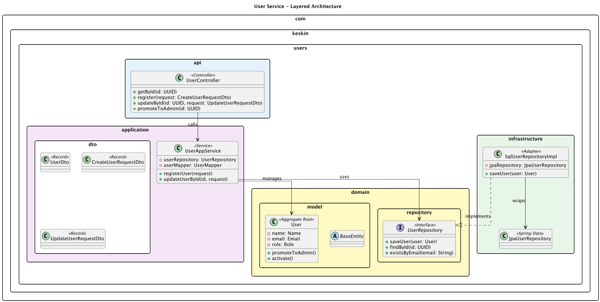
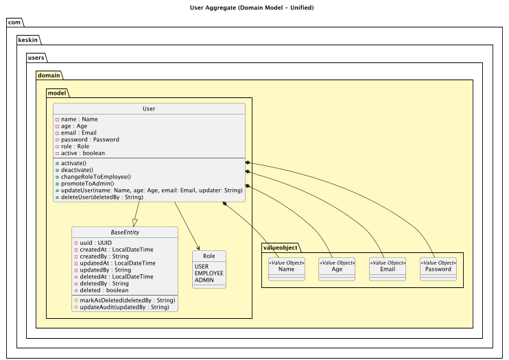

# User Management Service (DDD & Clean Architecture)

This is the **User Management Microservice**, built with **DDD** and **Clean Architecture** to ensure a decoupled and maintainable codebase. It serves as the identity provider for our distributed appointment system.

---

## System Architecture

### 1. Layered Architecture
Decouples Web, Application, Domain, and Infrastructure layers.

### 2. Domain Model
Contains Rich Entities (User) and immutable Value Objects (Email, Name, etc.).

> 💡 **Legend:** Check the [UML Guide](./users/docs/uml/UMLGUIDE.md) for symbol definitions.

---

## Microservice Roadmap

- **User Service (Active):** Identity & Access.
- **Appointment Service (Planned):** Scheduling & Logic.
- **Notification Service (Planned):** Alerts & Communication.

---

## Technical Specs

- **Rich Domain:** Logic is inside Entities, not just Services.
- **Value Objects:** Strongly typed attributes for validation.
- **Base Auditing:** Soft delete and audit logs via `BaseEntity`.

---

## Documentation

Detailed docs in [`/users/doc/uml`](./users/docs/uml):
- `.puml` files for all diagrams.
- `registration-flow` sequence.
- `UMLGUIDE.md` for notation.

---

## Quick Start

1. **Clone** and update `application.yml`.
2. **Run:** `./mvnw spring-boot:run`.
3. **Test:** Use the Postman collection at `POST /api/v1/users`.